# Decision Tree

← [Back to README](../README.md) · [API Reference](api.md) · [Concepts](concepts.md) · [Patterns](patterns.md)

---

- [1. Signal Creation](#1-signal-creation)
- [2. Signal Updates](#2-signal-updates)
- [3. Reacting to Changes](#3-reacting-to-changes)
- [4. Rate Limiting](#4-rate-limiting)
- [5. Batching](#5-batching)
- [6. Derived Values](#6-derived-values)
- [7. Dynamic Signal Identity](#7-dynamic-signal-identity)
- [8. Context / Shared State](#8-context--shared-state)
- [9. Persistence](#9-persistence)
- [10. Cross-tab Broadcast](#10-cross-tab-broadcast)

---

## 1. Signal Creation

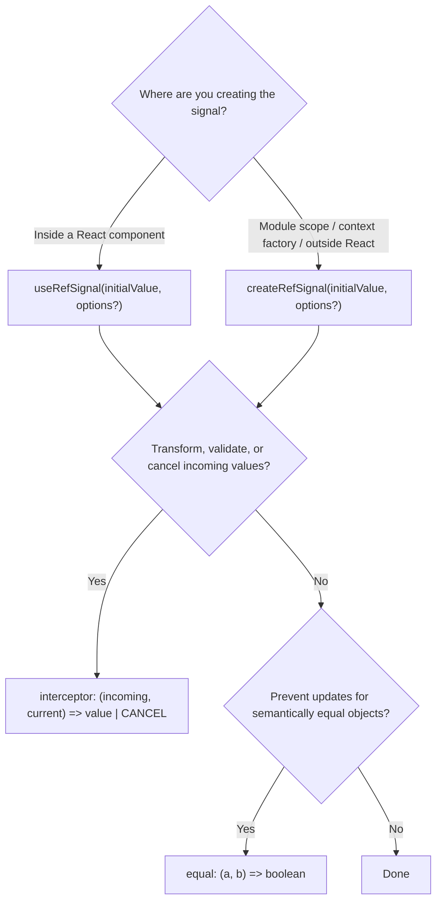

---

## 2. Signal Updates

> **Critical:** `useRefSignalRender` watches `lastUpdated`. Only `update()` and `notifyUpdate()` increment it. `notify()` alone never triggers a re-render.

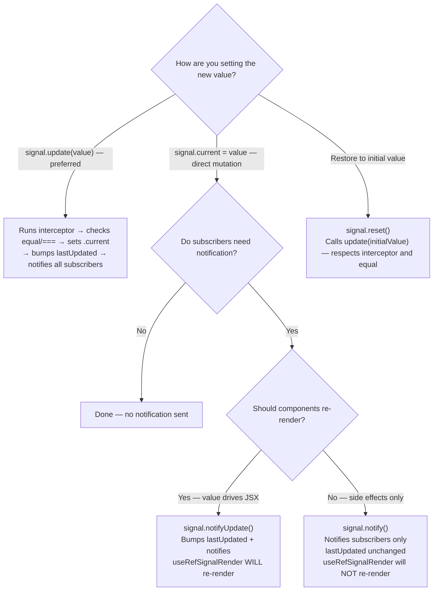

---

## 3. Reacting to Changes

> Use `watch(signal, listener, options?)` instead of `subscribe`/`unsubscribe` pairs when outside React — it returns a cleanup function and supports the same timing and filter options as hooks.
>
> For high-frequency imperative renderers (Pixi / Canvas / WebGL / Web Audio), see [Imperative renderers](imperative-renderers.md) — the canonical pattern is `useRefSignalEffect` + `{ rAF: true }` mutating a `ref`-held handle.

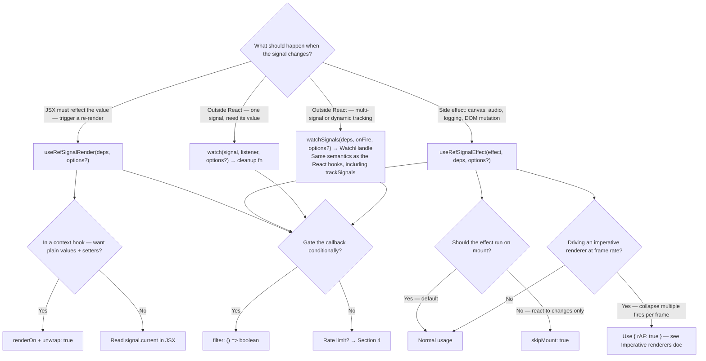

---

## 4. Rate Limiting

Applies to `watch()`, `useRefSignalEffect`, `useRefSignalRender`, context hooks, persist, and broadcast. **Options are mutually exclusive** — combining them is a TypeScript error.

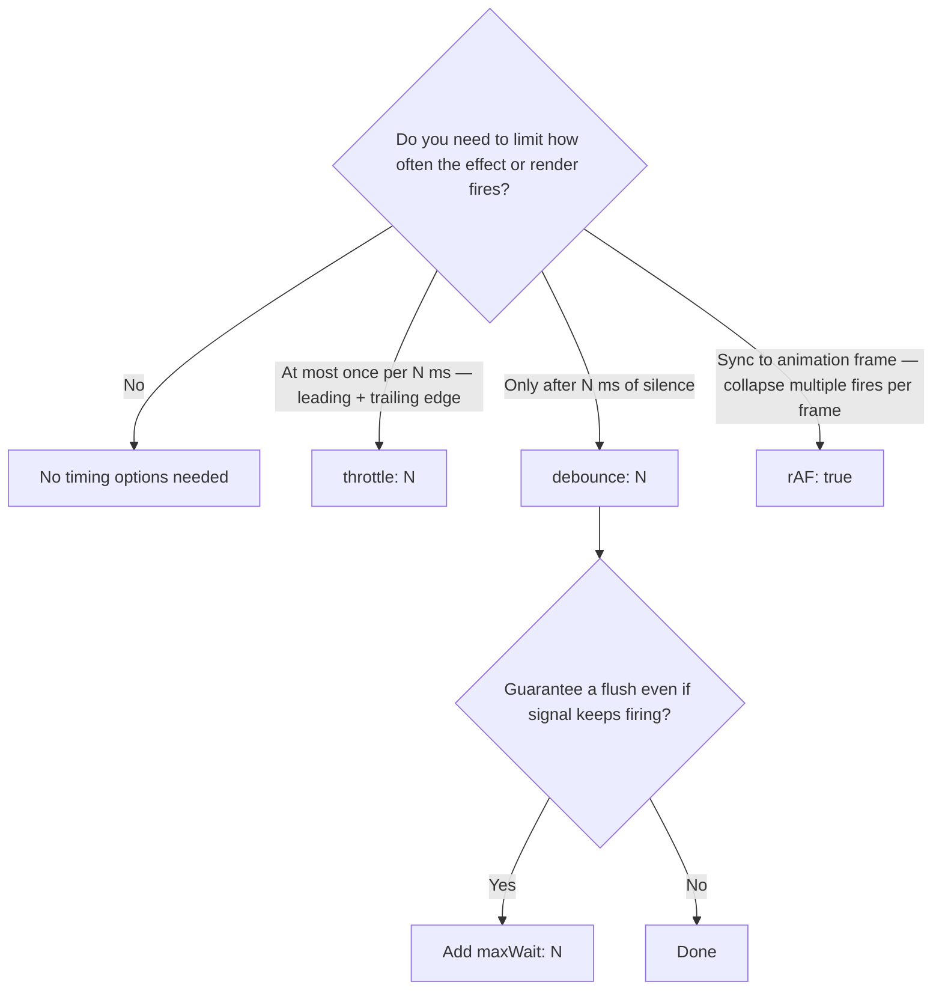

---

## 5. Batching

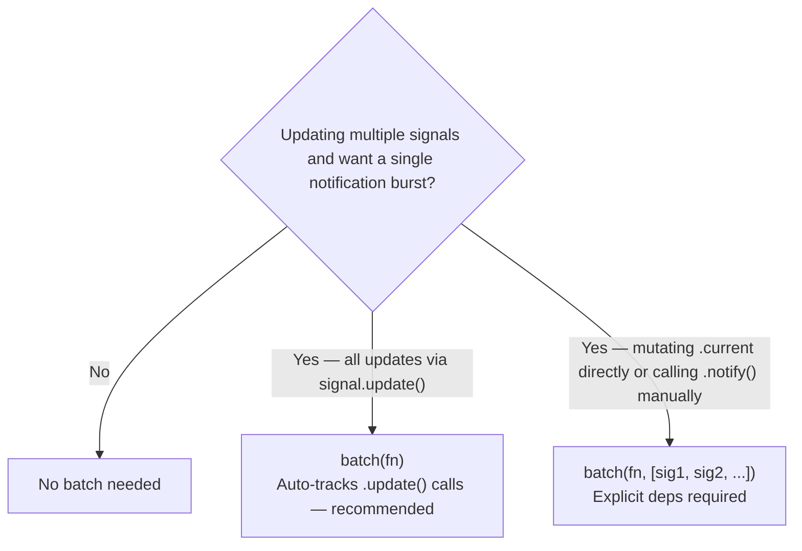

---

## 6. Derived Values

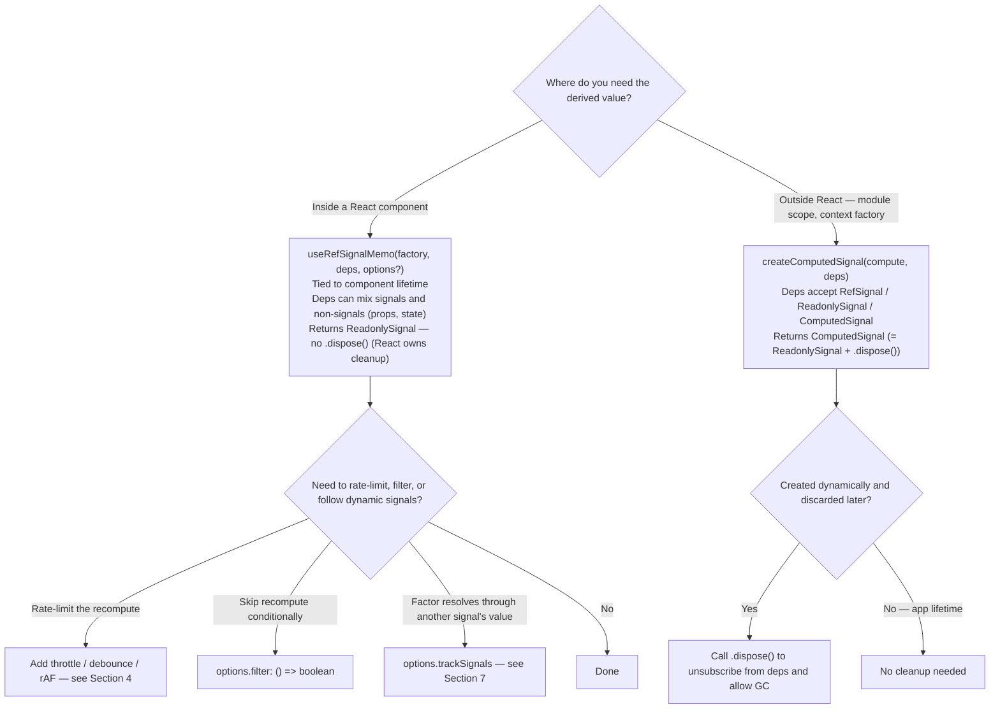

> **Polymorphic props pattern** — when writing a component that should accept either a `RefSignal<T>` or a plain `T` for the same prop:
> ```ts
> const stable = useRefSignalMemo(
>   () => (isRefSignal(input) ? input.current : input),
>   [input],
> );
> ```
> Normalizes into a single downstream shape. See [Imperative renderers](imperative-renderers.md#polymorphic-refsignalt--t-props).

---

## 7. Dynamic Signal Identity

> When the signal you want to react to is resolved *through another signal's current value* — e.g., `nodes.current.get(id)` inside a `RefSignal<Map<id, RefSignal<V>>>`. The inner signal's *identity* can change at runtime (added, removed, replaced) and your subscription must follow.

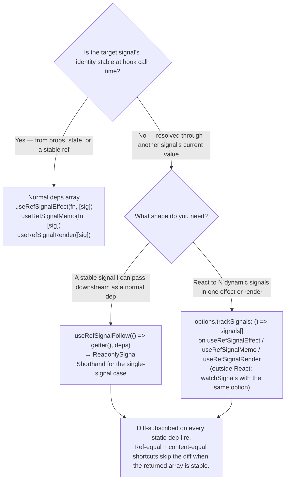

---

## 8. Context / Shared State

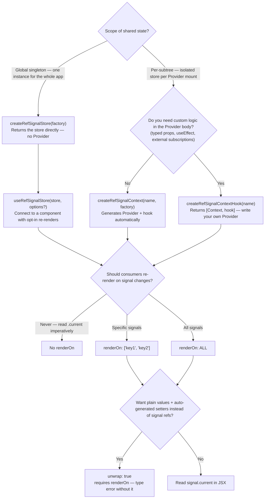

---

## 9. Persistence

> Activation: add `import 'react-refsignal/persist'` to your entry point. Safe to import in SSR environments.

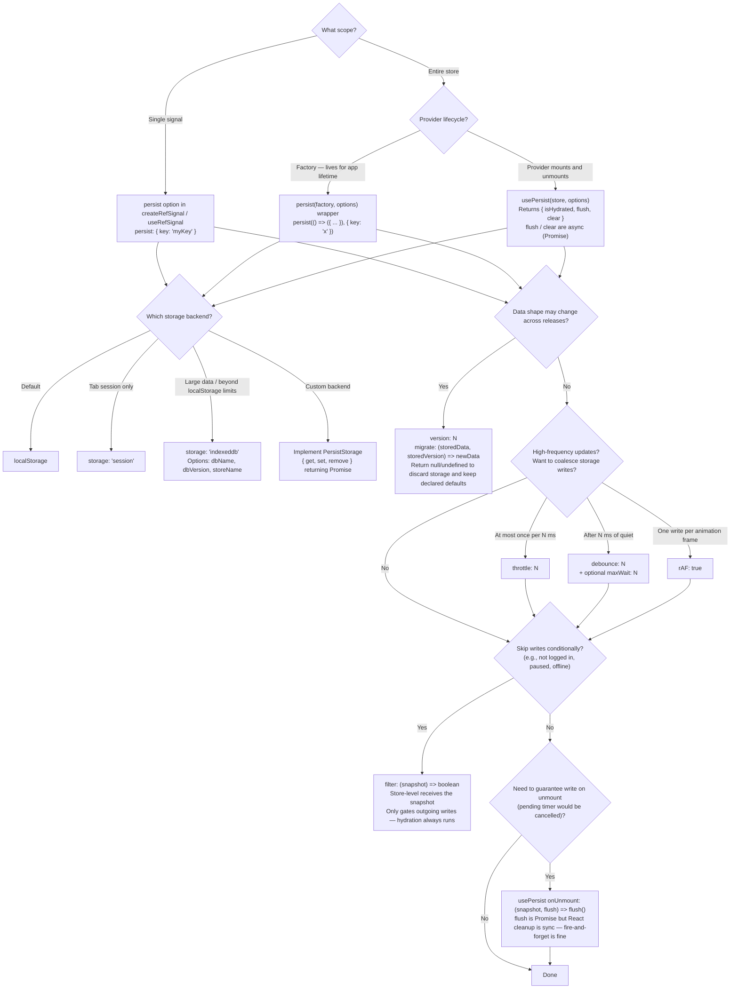

### Clearing persisted data

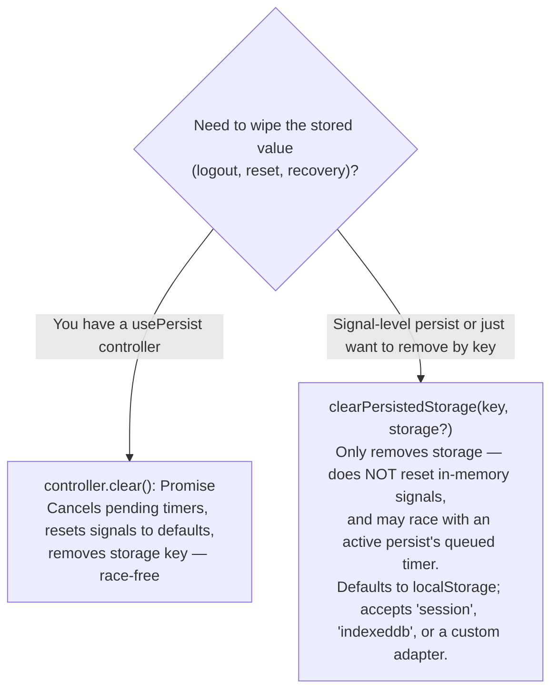

---

## 10. Cross-tab Broadcast

> Activation: add `import 'react-refsignal/broadcast'` to your entry point. Safe to import in SSR environments.

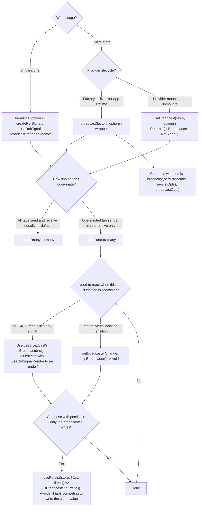
